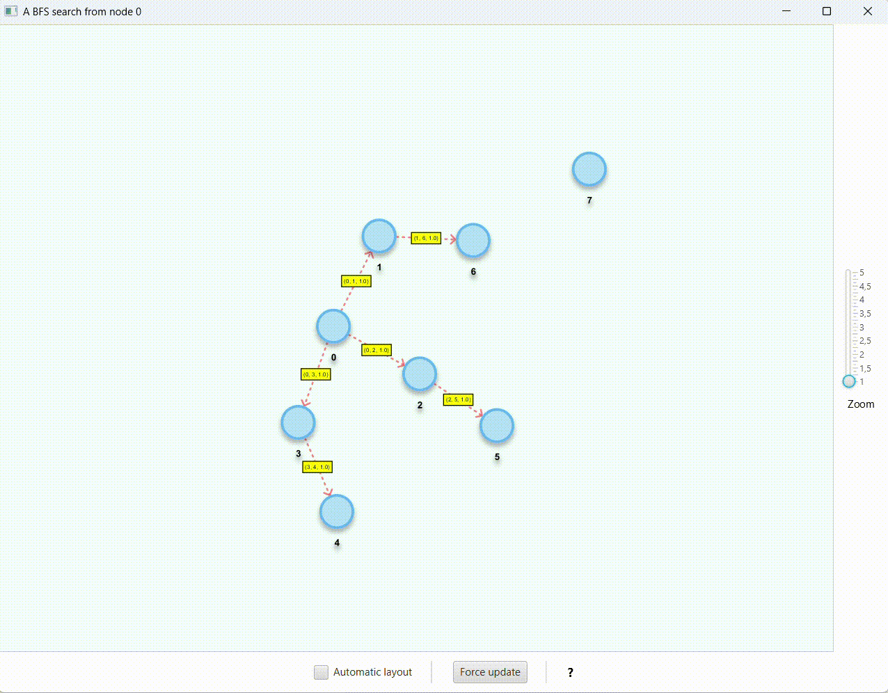

# GraphMateKTHelloWorld

A simple project containing the depencencies needed to use [GraphMateKT](https://github.com/Norskeaksel/GraphMateKT)

Running [Main.kt](src/main/kotlin/Main.kt) should result in the following animation:

